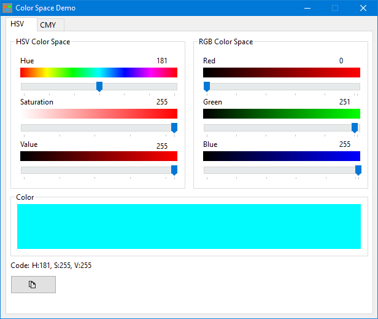

# A color space package for Free Pascal.
The package currently supports conversions between RGB and HSV, RGB and CMY color spaces. A demo is included as documentation for use case.
There is a nice article about [HSV color space here](https://en.wikipedia.org/wiki/HSL_and_HSV), and [CMY color space here](https://en.wikipedia.org/wiki/CMY_color_model).

* **[Demo](demo/mainframe.pas)** - A simple demo that utilizes the hsv color space package

