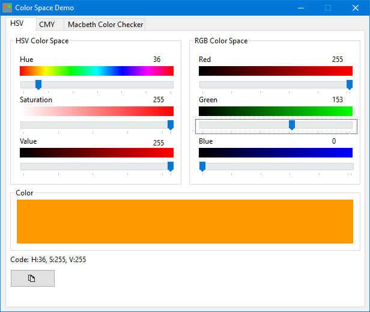

# A color space package for Free Pascal.
The package currently supports conversions between RGB and HSV color spaces. A demo is included as documentation for use case.
There is a nice article about [HSV color space here](https://en.wikipedia.org/wiki/HSL_and_HSV).

* **Principles** - The HSV are cylindrical geometries with hue, starting at red primary at 0 degrees, passing through the green at 120 degrees, and blue primary at 240 degrees. The central vertical axis comprises the neutral achromatic, or gray colors ranging from top to bottom with value 1 white to value 0 black.
In this geometry, the additive primary and secondary colors - red, yellow, green, cyan, blue and magenta - and linears mixtures between adjacents pairs of them, sometimes called pure colors, are arranged around the outside edge of the cylinder with saturation 1. These saturated colors have value 1. Mixing these pure colors with black - producing so called shades - leaves saturation unchanged. Tinting alone, reduces saturation.

* **[Demo](demo/mainframe.pas)** - A simple demo that utilizes the hsv color space package

